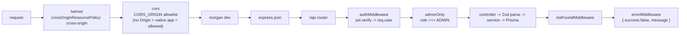
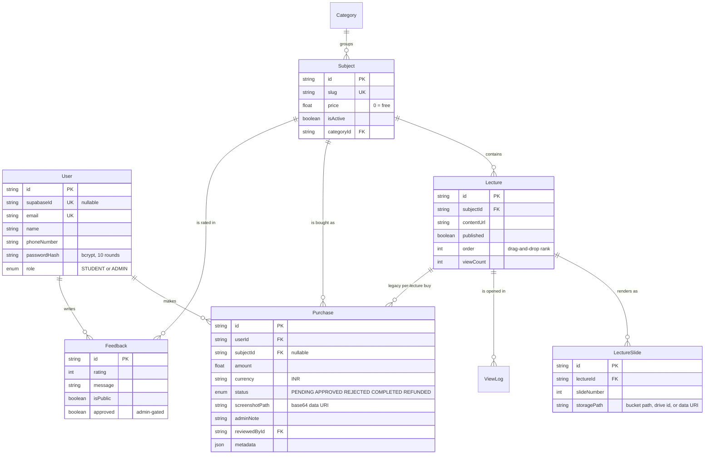
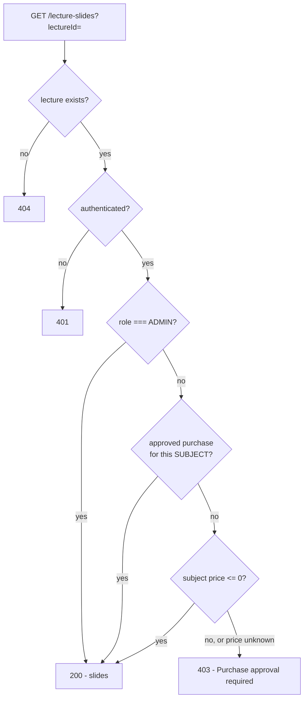
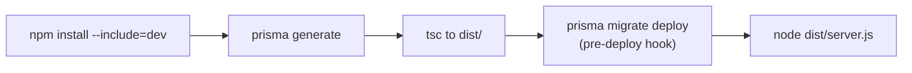

# Secure Study Hub — Backend API

Express 5 + TypeScript + Prisma 6 + PostgreSQL API powering the Secure Study Hub platform. It owns authentication, the content catalogue, purchase approval, entitlement checks and file delivery for both clients.

> **Architecture overview** — the full system diagram, pipelines, data model and security model live in the web repo: **[rupeshv2121/secure-study-hub](https://github.com/rupeshv2121/secure-study-hub)**.

| Component | Repository |
| --- | --- |
| **Backend API** (this repo) | [`secure-study-hub-backend`](https://github.com/rupeshv2121/secure-study-hub-backend) |
| Web client + architecture docs | [`secure-study-hub`](https://github.com/rupeshv2121/secure-study-hub) |
| Mobile client | [`secure-study-hub-mobile`](https://github.com/rupeshv2121/secure-study-hub-mobile) |

---

## Contents

- [Quick start](#quick-start)
- [Module architecture](#module-architecture)
- [API surface](#api-surface)
- [Data model](#data-model)
- [Authorization and entitlement](#authorization-and-entitlement)
- [File storage](#file-storage)
- [Email notifications](#email-notifications)
- [Environment variables](#environment-variables)
- [Deployment](#deployment)
- [Operational scripts](#operational-scripts)
- [Conventions](#conventions)
- [Known gaps](#known-gaps)

---

## Quick start

Requires Node 18+ and PostgreSQL 16 (Docker Compose included).

```bash
npm install
cp .env.example .env          # set DATABASE_URL and a long JWT_SECRET
docker compose up -d          # Postgres 16 on :5432
npm run prisma:migrate        # apply migrations
npm run prisma:generate
npm run dev                   # http://localhost:4000
```

Verify with `GET /api/health` — it returns `200` when healthy, or `500` with an `envIssues` object naming any misconfigured environment keys.

Promote your first admin after registering through a client:

```bash
node scripts/promote-admin.js you@example.com
```

| Script | Does |
| --- | --- |
| `npm run dev` | `ts-node-dev` with respawn and transpile-only |
| `npm run build` | `tsc` to `dist/` |
| `npm start` | Run the compiled server |
| `npm run prisma:migrate` | Create and apply a dev migration |
| `npm run prisma:deploy` | Apply pending migrations (production / pre-deploy) |
| `npm run prisma:generate` | Regenerate the Prisma client |
| `npm run prisma:studio` | Browse the database |

---

## Module architecture

Every feature is a **vertical slice** with the same four files, so routing, HTTP shaping, business logic and validation stay separable:

```
*.routes.ts      wiring + auth guards
   -> *.controller.ts   request/response shaping
      -> *.service.ts      Prisma queries + business rules
         *.schema.ts       Zod validation
```

```
src/
├─ app.ts                    # helmet -> CORS allowlist -> morgan -> json -> /api -> notFound -> error
├─ server.ts                 # HTTP listener (non-serverless targets)
├─ config/env.ts             # Zod-validated env, degrade-don't-die
├─ lib/
│  ├─ prisma.ts              # singleton client
│  ├─ supabase.ts            # service-role client, throws if unconfigured
│  └─ email.ts               # Resend wrapper, never throws
├─ middlewares/
│  ├─ auth.middleware.ts     # authMiddleware (JWT) + adminOnly (RBAC)
│  ├─ error.middleware.ts    # AppError -> uniform JSON envelope
│  └─ not-found.middleware.ts
├─ modules/
│  ├─ auth/                  # register, login, Supabase sync/webhook
│  ├─ categories/            # CRUD
│  ├─ subjects/              # CRUD, price, slug, isActive
│  ├─ lectures/              # CRUD, ordering, publish flag
│  ├─ lectureSlides/         # entitlement-checked slide listing
│  ├─ purchases/             # request, review, access check, notifications
│  ├─ viewLogs/              # view recording
│  ├─ feedback/              # submit, moderate, public listing
│  ├─ storage/               # Supabase upload, remove, signed URLs
│  └─ external/              # Google Drive stream, import, upload
├─ routes/index.ts           # composition + /health, /me, /admin/stats
├─ types/express.d.ts        # req.user augmentation
└─ utils/                    # AppError, asyncHandler
```

`api/` holds the Vercel serverless entrypoints (`index.ts` and the `[...path].ts` catch-all) that wrap the same `app`.

### Middleware chain



### Config that refuses to die

[`src/config/env.ts`](src/config/env.ts) validates with Zod but deliberately does **not** call `process.exit(1)` on failure. On a serverless platform a hard exit turns every route into an opaque `FUNCTION_INVOCATION_FAILED` with no clue why. Instead it:

1. Treats blank strings (`""`, which is what platforms inject for undefined vars) as unset rather than as validation errors.
2. Falls back to a best-effort env object so the process still boots.
3. Exposes the failing **key names and messages only — never values** — through `GET /api/health`.

---

## API surface

Base URL `<host>/api`. All responses use `{ success, data | message }`. Auth is `Authorization: Bearer <jwt>`.

**Legend** — `pub` public, `auth` authenticated, `admin` admin only.

| Method | Endpoint | Auth | Purpose |
| --- | --- | :-: | --- |
| GET | `/health` | pub | Liveness; 500 + `envIssues` when config is invalid |
| POST | `/auth/register` | pub | Create account, returns `{ user, token }` |
| POST | `/auth/login` | pub | Exchange credentials for a JWT |
| POST | `/auth/sync` | pub | Upsert a user from Supabase Auth (legacy bridge) |
| POST | `/auth/webhook` | pub | Supabase user-created webhook target |
| GET | `/me` | auth | Current profile from the database |
| PUT | `/me` | auth | Update name / phone |
| GET | `/categories`, `/categories/:id` | pub | List / read categories |
| POST, PUT, DELETE | `/categories`, `/categories/:id` | admin | Category CRUD |
| GET | `/subjects`, `/subjects/:id` | pub | List / read subjects |
| POST, PUT, DELETE | `/subjects`, `/subjects/:id` | admin | Subject CRUD |
| GET | `/lectures`, `/lectures/:id` | pub | List / read lectures (metadata only) |
| POST, PUT, DELETE | `/lectures`, `/lectures/:id` | admin | Lecture CRUD, ordering, publish flag |
| GET | `/lecture-slides?lectureId=` | auth | **Entitlement-checked** slide list |
| POST | `/lecture-slides` | admin | Attach a slide to a lecture |
| DELETE | `/lecture-slides/:id` | admin | Remove a slide |
| POST | `/purchases` | auth | Submit a purchase request (multipart, field `screenshot`, max 8 MB) |
| GET | `/purchases` | auth | Own purchases; all purchases when admin |
| GET | `/purchases/:id` | auth | Purchase detail |
| POST | `/purchases/:id/review` | admin | Approve / reject with an admin note |
| POST | `/view-logs` | auth | Record a lecture view |
| GET | `/feedbacks/public` | pub | Approved public testimonials |
| POST | `/feedbacks` | pub | Submit feedback (auth optional) |
| GET | `/feedbacks` | admin | All feedback for moderation |
| PUT | `/feedbacks/:id/approve` | admin | Publish a testimonial |
| POST | `/storage/:bucket/upload` | admin | Upload a file (multipart, field `file`) |
| POST | `/storage/:bucket/remove` | admin | Delete objects |
| GET | `/storage/:bucket/signed-url?path=` | auth | Mint a 300s signed URL |
| GET | `/storage/:bucket/exists` | auth | Debug: does an object exist |
| GET | `/external/drive/:id/stream` | auth | Proxy-stream a Drive file |
| POST | `/external/drive/:id/import` | admin | Copy a Drive file into a bucket |
| POST | `/external/drive/upload` | admin | Upload straight to Drive |
| GET | `/external/drive/:id/meta`, `/debug`, `/external/test` | pub | **`NODE_ENV=development` only** — Drive diagnostics and a test viewer page |
| GET | `/admin/stats` | admin | Totals plus the 10 most recent views |

> The `/external/drive/*` debug routes are registered **only** when `NODE_ENV === "development"`. They are unauthenticated by design for local testing, so never run a production deployment with `NODE_ENV=development`.

---

## Data model



Canonical schema: [`prisma/schema.prisma`](prisma/schema.prisma), with 14 migrations in [`prisma/migrations/`](prisma/migrations/).

> The `supabase/migrations/` directory is **legacy** — it holds the SQL/RLS schema from the pre-Prisma Supabase architecture and is no longer the source of truth. Prisma owns the schema.

---

## Authorization and entitlement

Two independent layers:

**1. Role (`adminOnly`)** — every mutating route is guarded in `*.routes.ts`, and the slide and purchase controllers re-assert the role themselves rather than trusting the router alone.

**2. Entitlement (`hasApprovedSubjectAccess`)** — the real content gate, enforced in [`src/modules/lectureSlides/slides.controller.ts`](src/modules/lectureSlides/slides.controller.ts):



Two rules worth stating explicitly, because both are easy to get wrong:

- **Gate on the subject, never the lecture.** `Lecture.price` defaults to `0`, so gating on it would read every lecture as free.
- **Fail closed.** A missing subject price is treated as infinite (`Number.POSITIVE_INFINITY`), so an unknown price denies access rather than granting it.

`hasApprovedSubjectAccess` accepts a purchase attached either directly to the subject or to a lecture within it, and counts both `APPROVED` and `COMPLETED` as granting access.

---

## File storage

Slides live in **private** Supabase buckets and are only ever delivered through signed URLs with a **300-second TTL** (`SIGNED_URL_EXPIRY_SECONDS` in [`src/modules/storage/storage.service.ts`](src/modules/storage/storage.service.ts)).

| Concern | Handling |
| --- | --- |
| Path traversal | `normalizeStoragePath` rejects `..`, leading slashes and bucket-escaping paths |
| Missing bucket | Auto-created as **private** on first upload, then the upload is retried once |
| Temp files | Written to `/tmp/uploads` on Vercel (`tmp/uploads` locally) and unlinked in a `finally` block |
| Quota errors | Mapped to HTTP `413`; missing objects to `404` |
| Large PDFs | Optional Google Drive path — slides store `drive:<fileId>` and stream through the authenticated proxy endpoint |

`storagePath` is polymorphic and clients branch on its shape: a plain bucket path resolves to a signed URL, `drive:<id>` streams through `/external/drive/:id/stream`, and `https://` or `data:` values are used verbatim.

Google Drive access needs a service account with the target files shared to it; supply the credential as one-line JSON in `GOOGLE_SERVICE_ACCOUNT_JSON` (use `scripts/setGoogleEnv.js` to flatten a key file). **Never commit the key file itself.**

---

## Email notifications

[`src/lib/email.ts`](src/lib/email.ts) wraps Resend and is **designed never to throw** — it returns `false` and logs on any failure. A mail outage must never break purchase creation.

When `RESEND_API_KEY` is unset the send is skipped with a warning, so local development works with no mail configuration at all. The one live notification today is `notifyAdminOfPurchaseRequest`, sent to `ADMIN_NOTIFICATION_EMAIL` when a student submits a purchase request.

---

## Environment variables

| Variable | Required | Default | Notes |
| --- | :-: | --- | --- |
| `DATABASE_URL` | yes | — | PostgreSQL connection string |
| `JWT_SECRET` | yes | — | At least 16 characters, enforced by Zod |
| `PORT` | no | `4000` | Do **not** set on Render — the platform injects it |
| `NODE_ENV` | no | `development` | `development` also exposes the unauthenticated Drive debug routes |
| `JWT_EXPIRES_IN` | no | `7d` | |
| `CORS_ORIGIN` | no | `http://localhost:5173` | Comma-separated allowlist |
| `SUPABASE_URL` | no | — | Required for uploads and signed URLs |
| `SUPABASE_SERVICE_ROLE_KEY` | no | — | **Server-only secret.** Never ship this to a client |
| `SUPABASE_WEBHOOK_SECRET` | no | — | Present in the schema; see [Known gaps](#known-gaps) |
| `GOOGLE_SERVICE_ACCOUNT_JSON` | no | — | Full JSON on one line |
| `GOOGLE_DRIVE_FOLDER_ID` | no | — | Upload destination |
| `RESEND_API_KEY` | no | — | Unset means emails are logged and skipped, never fatal |
| `EMAIL_FROM` | no | `Secure Study Hub <onboarding@resend.dev>` | |
| `ADMIN_NOTIFICATION_EMAIL` | no | — | Purchase-request recipient |

A blank value (`""`) is treated as unset rather than as a validation failure — the deliberate fix for platforms that inject empty strings for undefined variables.

---

## Deployment

### Render (primary)

Config is checked in at [`render.yaml`](render.yaml).

| Setting | Value |
| --- | --- |
| Root directory | this repository |
| Build | `npm install --include=dev && npm run prisma:generate && npm run build` |
| Pre-deploy | `npm run prisma:deploy` |
| Start | `npm start` |
| Env | `DATABASE_URL`, `JWT_SECRET`, `JWT_EXPIRES_IN`, `CORS_ORIGIN`, plus Supabase / Google / Resend keys as needed |

`--include=dev` matters: `prisma` and `typescript` are devDependencies and the build needs them. Do not hardcode `PORT`.

### Vercel (serverless alternative)

Build command `npm run prisma:generate && npm run build` (see [`vercel.json`](vercel.json)); [`api/[...path].ts`](api/) is the catch-all handler wrapping the same Express app.

Uploads use ephemeral `/tmp`, so a file must reach Supabase within the same invocation — which is what the upload service does before unlinking. Also budget for Prisma cold starts and keep a pooled `DATABASE_URL`.

### Deploy pipeline



---

## Operational scripts

| Script | Purpose |
| --- | --- |
| `node scripts/promote-admin.js <email>` | Grant `ADMIN` to an existing user |
| `node scripts/createBucket.js` | Create the private Supabase bucket |
| `node scripts/listSlides.js` | Inspect stored slides |
| `node scripts/create-purchase-test.js` | Seed a purchase to exercise the review queue |
| `node scripts/test-email.js` | Verify the Resend configuration |
| `node scripts/setGoogleEnv.js` | Flatten a service-account JSON into an env value |

---

## Conventions

- **Add a feature by copying the slice shape** (`routes` -> `controller` -> `service` -> `schema`), not by extending a shared controller.
- **Errors**: throw `AppError(message, status)` and wrap async handlers in `asyncHandler`, so rejections reach `errorMiddleware` instead of hanging the request.
- **Responses** are always `{ success: boolean, ... }` — both clients depend on that envelope.
- **Validation** belongs in `*.schema.ts` (Zod) and is parsed in the controller, never inline in a service.
- **Secrets** never leave the server. The anon key is the only Supabase credential a client may hold.

---

## Known gaps

- **No tests.** `npm test` is a placeholder echo.
- **Purchase screenshots are stored as base64 data URIs** in `Purchase.screenshotPath` rather than in object storage, inflating row size and every purchase list payload.
- **No rate limiting** on `/auth/login` or `/auth/register`.
- **`/auth/webhook` is unauthenticated** even though `SUPABASE_WEBHOOK_SECRET` exists in the config schema — the secret is not yet verified in the handler.
- **Dual auth path.** Password auth in Postgres is the live system; `/auth/sync`, `/auth/webhook` and `supabase/migrations/` are leftovers from the earlier Supabase-RLS architecture.
- **`reviewPurchase` ignores its `reviewerId` argument**, so `Purchase.reviewedById` is never populated even though `reviewedAt` is.
